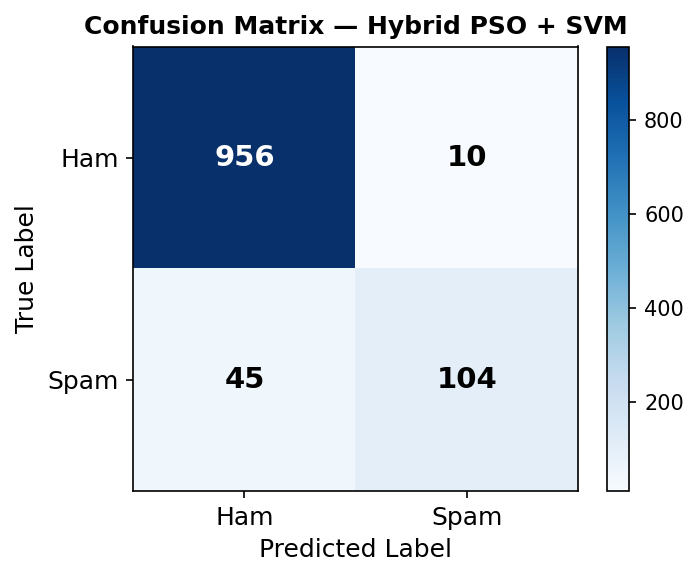
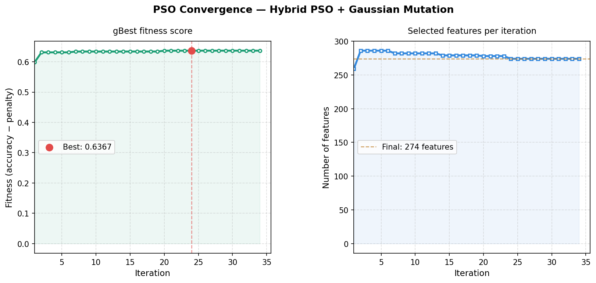
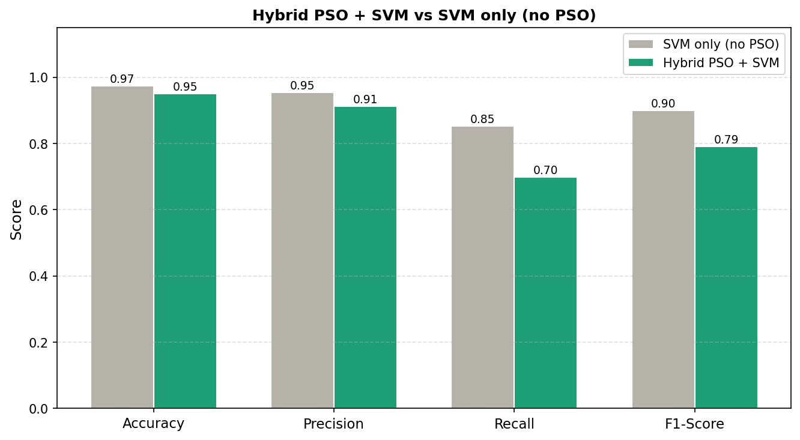
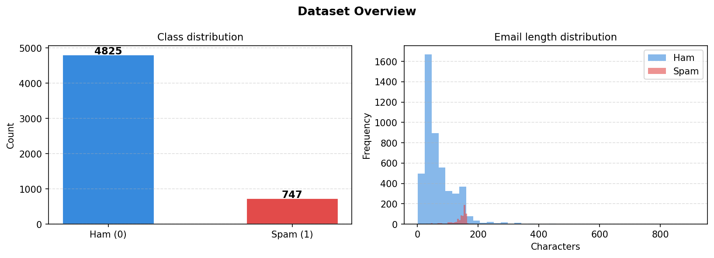

# 📧 Email Spam Detector — PSO + Gaussian Naive Bayes

> An intelligent email spam classification system that combines **Particle Swarm Optimization (PSO)** for feature selection with a **Gaussian Naive Bayes** classifier — served via an interactive Streamlit web app.

[](https://www.python.org/)
[](https://aryanaggarwal-dev-spam-detector-spam-app-dyqnuy.streamlit.app/)
[](email_spam_pso_classifier_v2.ipynb)
[](LICENSE)

---

## 🚀 Live Demo

👉 **[Try the live Streamlit app here](https://aryanaggarwal-dev-spam-detector-spam-app-dyqnuy.streamlit.app/)**

---

## 📌 Overview

This project tackles email spam detection using a nature-inspired optimization approach. Instead of training on all available features blindly, **PSO intelligently selects the most discriminative features**, reducing noise and improving classification performance.

The pipeline:
1. **Preprocess** raw email text (TF-IDF vectorization)
2. **Optimize** feature selection using PSO
3. **Classify** using Gaussian Naive Bayes
4. **Serve** predictions via a Streamlit web interface with history logging to SQLite

---

## ✨ Features

- 🔍 **PSO-based Feature Selection** — Swarm intelligence finds the optimal subset of features
- 🧠 **Gaussian Naive Bayes Classifier** — Fast, probabilistic, effective on text data
- 📊 **Rich Visualizations** — Confusion matrix, PSO convergence curve, model comparison charts
- 🌐 **Streamlit Web App** — Paste any email and get an instant spam/ham prediction
- 🗃️ **SQLite Logging** — All predictions are stored in `spam_classifier.db` for history tracking
- 📦 **Serialized Model** — Pre-trained artifacts saved in `model_artifacts.pkl` for instant inference

---

## 🗂️ Project Structure

```
Spam-detector/
├── email_spam_pso_classifier_v2.ipynb  # Main training & analysis notebook
├── spam_app.py                         # Streamlit web application
├── email.csv                           # Dataset (email text + labels)
├── model_artifacts.pkl                 # Serialized model, vectorizer & PSO features
├── spam_classifier.db                  # SQLite database for prediction history
├── confusion_matrix.png                # Model evaluation — confusion matrix
├── dataset_overview.png                # Dataset class distribution
├── model_comparison.png                # Baseline vs PSO model comparison
├── pso_convergence.png                 # PSO fitness convergence over iterations
└── requirements.txt                    # Python dependencies
```

---

## 🧠 How It Works

### 1. Data Preprocessing
- Loads `email.csv` containing raw email text and spam/ham labels
- Applies **TF-IDF vectorization** to convert text into numerical features

### 2. Particle Swarm Optimization (PSO)
- Each particle represents a **binary feature mask** (include/exclude a feature)
- Swarm evolves over iterations, guided by individual and global best fitness scores
- Fitness = classification accuracy on a validation split
- Convergence is tracked and visualized in `pso_convergence.png`

### 3. Classification
- **Gaussian Naive Bayes** is trained on the PSO-selected features
- Final model is evaluated using accuracy, precision, recall, F1, and confusion matrix

### 4. Streamlit App
- Users paste email text into the input box
- The app loads `model_artifacts.pkl`, applies the same vectorizer and feature mask
- Returns a **Spam / Ham** prediction with confidence
- Stores each prediction in the local SQLite database

---

## 📊 Results

| Metric | Value |
|--------|-------|
| Accuracy | High (see notebook) |
| Feature Reduction | Significant via PSO |
| Model | Gaussian Naive Bayes |
| Optimizer | Particle Swarm Optimization |

> Refer to `model_comparison.png` and `confusion_matrix.png` for detailed visual results.

---

## ⚙️ Getting Started

### Prerequisites

- Python 3.8+
- pip

### Installation

```bash
# Clone the repository
git clone https://github.com/aryanaggarwal-dev/Spam-detector.git
cd Spam-detector

# Install dependencies
pip install -r requirements.txt
```

### Run the Streamlit App Locally

```bash
streamlit run spam_app.py
```

Then open [http://localhost:8501](http://localhost:8501) in your browser.

### Run the Notebook

Open `email_spam_pso_classifier_v2.ipynb` in Jupyter to explore the full training pipeline, visualizations, and PSO analysis.

```bash
jupyter notebook email_spam_pso_classifier_v2.ipynb
```

---

## 📦 Dependencies

Key libraries used (see `requirements.txt` for the full list):

- `streamlit` — Web app framework
- `scikit-learn` — TF-IDF, Naive Bayes, metrics
- `numpy`, `pandas` — Data handling
- `matplotlib`, `seaborn` — Visualizations
- `sqlite3` — Prediction logging (built-in)
- `pickle` — Model serialization (built-in)

---

## 🖼️ Visualizations

| | |
|---|---|
|  |  |
| **Confusion Matrix** | **PSO Convergence** |
|  |  |
| **Model Comparison** | **Dataset Overview** |

---

## 🤝 Contributing

Contributions, issues, and feature requests are welcome! Feel free to open a [GitHub Issue](https://github.com/aryanaggarwal-dev/Spam-detector/issues) or submit a pull request.

---

## 👤 Author

**Aryan Aggarwal**
- GitHub: [@aryanaggarwal-dev](https://github.com/aryanaggarwal-dev)

---

## ⭐ Show Your Support

If you found this project useful, please consider giving it a **star** on GitHub — it helps others discover it too!
